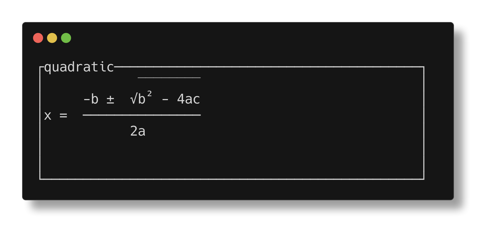
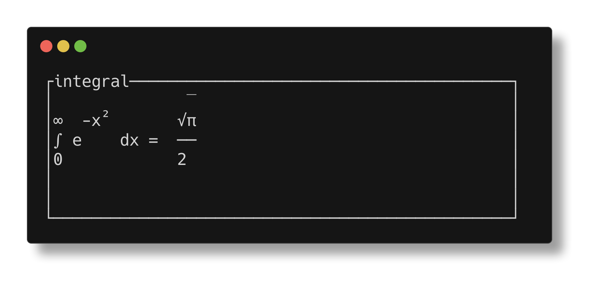
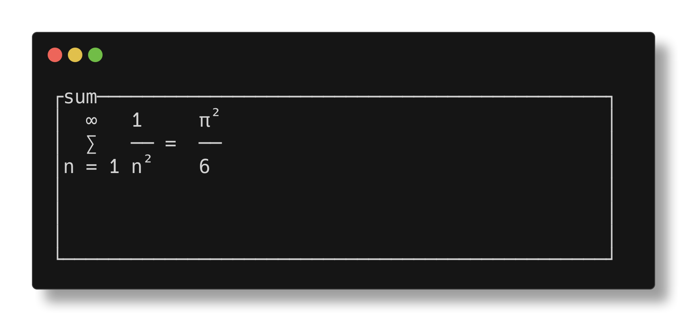
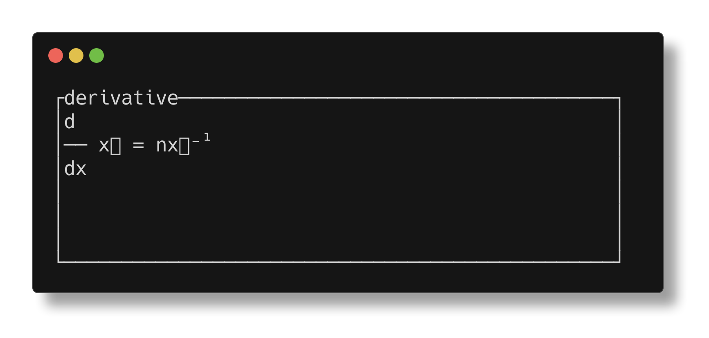
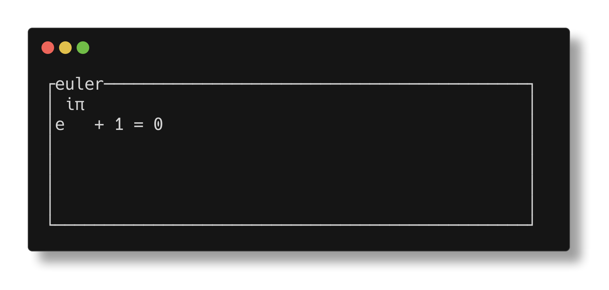
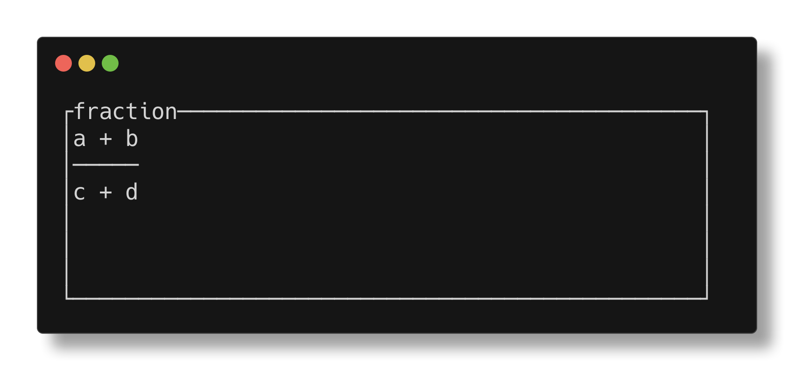
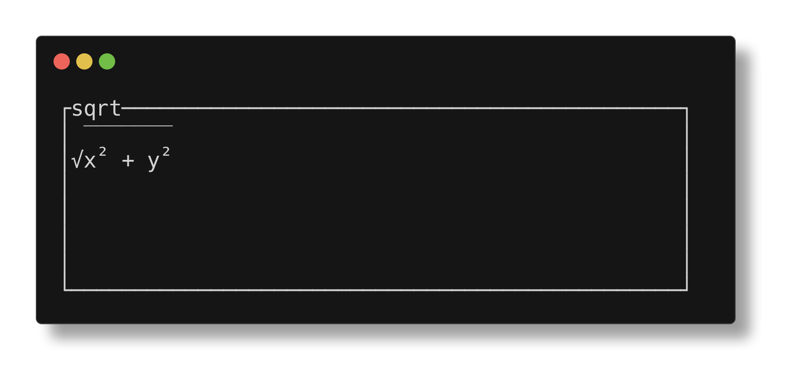

# tui-math

Render LaTeX math beautifully in terminal UIs with [ratatui](https://github.com/ratatui/ratatui).



## Features

- LaTeX to Unicode terminal rendering
- MathML intermediate format support
- Native ratatui widget
- Unicode superscripts/subscripts when possible
- 2D rendering for fractions, roots, big operators
- Greek letters and mathematical symbols

## Installation

```toml
[dependencies]
tui-math = "0.1"
```

## Usage

### Simple rendering

```rust
use tui_math::render_latex;

let rendered = render_latex(r"\frac{x^2 + 1}{y}")?;
println!("{}", rendered);
```

### As a ratatui widget

```rust
use tui_math::MathWidget;
use ratatui::widgets::Block;

let widget = MathWidget::new(r"\int_0^\infty e^{-x^2} dx")
    .block(Block::bordered().title("Math"));

frame.render_widget(widget, area);
```

### Stateful widget for caching

```rust
use tui_math::{MathWidgetState, StatefulMathWidget};

// Create state once
let mut state = MathWidgetState::new();
state.update(r"\sum_{i=1}^n i^2", true);

// Render multiple times without re-parsing
let widget = StatefulMathWidget::new();
widget.render(area, buf, &state);
```

## Examples

Run the interactive demo:

```sh
cargo run
```

Or the simple CLI example:

```sh
cargo run --example simple
```

## Rendering Examples

| Formula | Screenshot |
|---------|------------|
| Integral: `\int_0^\infty e^{-x^2} dx = \frac{\sqrt{\pi}}{2}` |  |
| Sum: `\sum_{n=1}^{\infty} \frac{1}{n^2} = \frac{\pi^2}{6}` |  |
| Derivative: `\frac{d}{dx} x^n = nx^{n-1}` |  |
| Euler: `e^{i\pi} + 1 = 0` |  |
| Fraction: `\frac{a + b}{c + d}` |  |
| Square Root: `\sqrt{x^2 + y^2}` |  |

## Supported LaTeX

- Basic math: `+`, `-`, `*`, `/`, `=`, etc.
- Superscripts: `x^2`, `e^{i\pi}`
- Subscripts: `a_1`, `x_{ij}`
- Fractions: `\frac{a}{b}`
- Square roots: `\sqrt{x}`, `\sqrt[3]{x}`
- Greek letters: `\alpha`, `\beta`, `\Gamma`, etc.
- Big operators: `\sum`, `\prod`, `\int`, `\oint`
- Relations: `\leq`, `\geq`, `\neq`, `\equiv`, etc.
- Arrows: `\rightarrow`, `\Rightarrow`, `\leftrightarrow`
- Functions: `\sin`, `\cos`, `\log`, `\lim`, etc.
- Delimiters: `\langle`, `\rangle`, `\lceil`, `\rfloor`

## How it works

1. LaTeX → MathML via `latex2mathml`
2. MathML parsed with `roxmltree`
3. Rendered to 2D character grid (MathBox)
4. Unicode characters used where possible
5. Integrated with ratatui's Widget trait

## License

MIT
